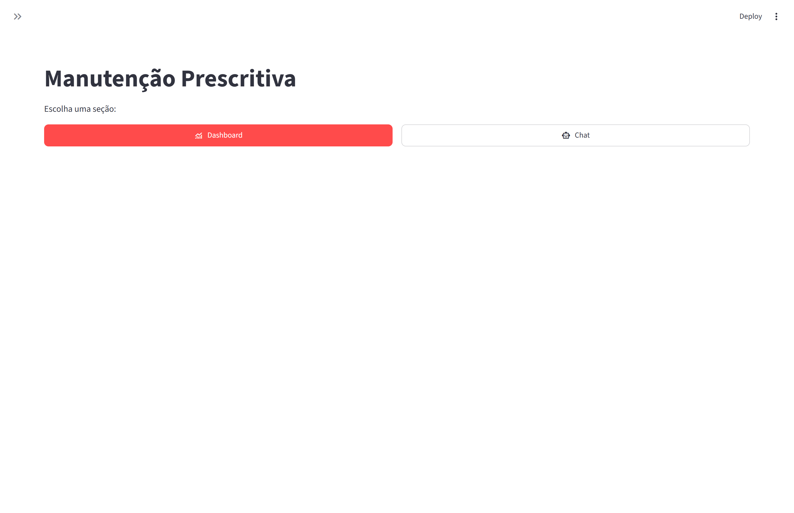
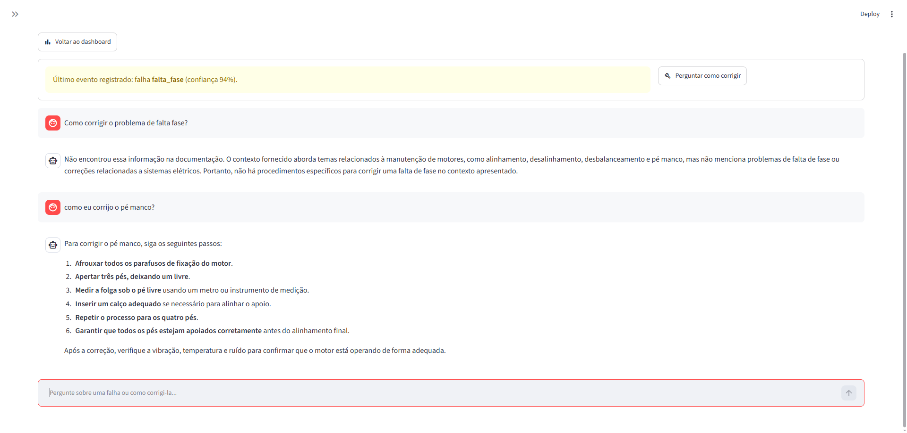
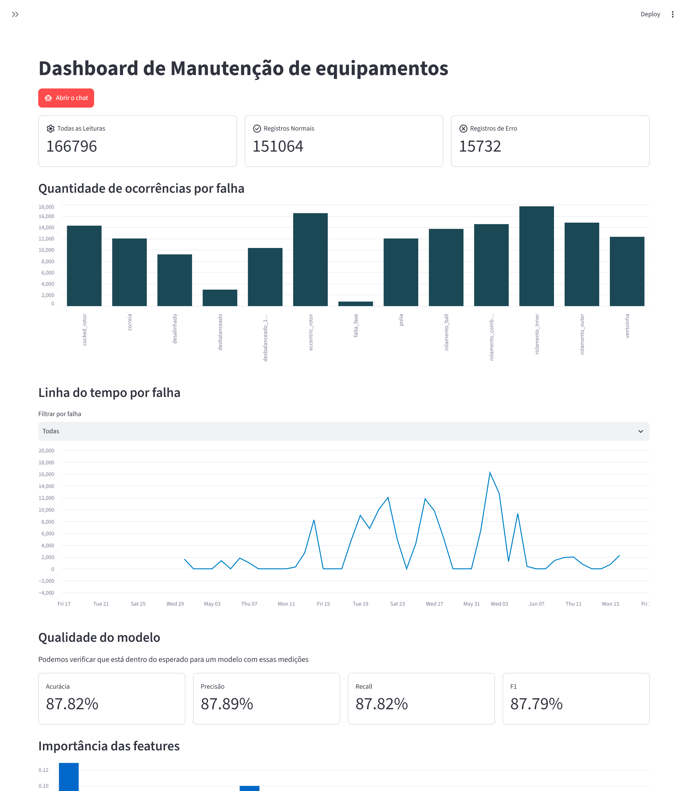

# fullstack IA com Python

- [x] setup de ambiente virtual
- [x] instalação de dependências
- [x] iniciar notebook
- [x] carregar dados do pdf
- [x] testar com ollama
- [x] carregar dados do csv
- [x] gerar embeddings e vectorstore
- [x] implementar RAG
- [x] implementar modelo preditivo
- [x] treinar modelo preditivo
- [x] testar modelo preditivo
- [x] configurar StreamLit (melhor para interface e plotagem de gráficos)
- [x] integrar tudo

## Prints da aplicação

### Tela inicial da aplicação:


### Tela de predição:


### Dashboard
 

## Programas necessários para rodar localmente

- **Docker**: [Docker](https://www.docker.com/products/docker-desktop/)
- **Tesseract-OCR**: acesse o site: [Tesseract OCR](https://tesseractocr.org/). _Reponsável por extrair o texto de imagens._
- **Python 3.10+**
- **Ollama**: [Ollama](https://ollama.com/download)
- **Postgresql**

### Rodando localmente

Primeiro você precisa ter instalado no seu computador os seguintes programas: Python 3.10+, Ollama, Tesseract-OCR e Postgresql.

Dê um git clone neste projeto, com o python realize a criação da venv e instale os requirements:

```bash
python -m venv .venv
.venv\Scripts\activate
pip install -r requirements.txt
```

Depois de realizado o processo acima, você já pode rodar a aplicação:

```bash
python src/main.py
```

## Rodando com Docker

A stack sobe quatro serviços: PostgreSQL, pgAdmin, Ollama e a aplicação (pipeline de predição + frontend Streamlit). Nada além do Docker precisa estar instalado, o Ollama roda em container e baixa os modelos sozinho.

```bash
cp .env.example .env && docker compose up --build
```

| Serviço    | URL                     |
|------------|-------------------------|
| Streamlit  | http://localhost:8501   |
| pgAdmin    | http://localhost:5050   |
| Ollama API | http://localhost:11435  |

A **primeira** subida é demorada, pq além do build (~4 min), o container baixa `Qwen3:1.7B` (1.4GB) e `Qwen3-Embedding` (4.7GB) e faz a carga inicial das ~200 mil linhas do `banner.csv` no Postgres. As subidas seguintes reaproveitam o volume `ollama_models` e pulam a carga (o import é idempotente).

Acompanhe com `docker compose logs -f app`.

### Atalho: reaproveitar os modelos já instalados no host

Se você já tem o Ollama rodando na máquina com os modelos baixados, dá para pular os 6GB de download apontando a aplicação para ele. Crie um `docker-compose.override.yml` (o Compose o aplica automaticamente):

```yaml
services:
  app:
    environment:
      OLLAMA_HOST: http://host.docker.internal:11434
    # `!override` substitui o depends_on do arquivo base em vez de mesclar —
    # sem isso o Compose ainda subiria o container do Ollama.
    depends_on: !override
      postgres:
        condition: service_healthy
```

E sobe sem o container do Ollama:

```bash
docker compose up postgres pgadmin app
```

A comparação de nomes é case-insensitive e normaliza a tag `:latest`, então `Qwen3:1.7B` no `config.json` encontra `qwen3:1.7b` no host normalmente.

### Comandos úteis

```bash
docker compose up -d              # sobe em background
docker compose logs -f app        # acompanha o pipeline e o Streamlit
docker compose down               # para tudo (preserva os volumes)
docker compose down -v            # para e APAGA banco, pgAdmin e modelos
docker compose exec app bash      # shell dentro do container da aplicação
docker compose build --no-cache app
```

### Como as peças se conectam

- **Modelos**: os nomes vivem em `src/config/config.json` (`MODEL` e `EMBEDDING_MODEL`). O `docker/ensure_models.py` lê esse mesmo arquivo no start e baixa o que faltar — trocar o modelo lá é suficiente, não há nome duplicado no `.env`.
- **Ollama**: o container recebe `OLLAMA_HOST=http://ollama:11434`. O client do Ollama usa essa variável como fallback, então `ChatOllama` e `OllamaEmbeddings` passam a apontar para o container sem alteração de código.
- **Banco**: `src/database/database.py` lê `DB_HOST`/`DB_PORT`/credenciais do ambiente, com o `config.json` como fallback. Fora do Docker continua indo para `localhost`; dentro, o compose injeta `postgres`.
- **vectorstore/**: montado como bind mount, não como volume nomeado. O índice FAISS e o `fault_model.pkl` versionados no repositório ficam disponíveis já na primeira subida, e o que o container gravar aparece na sua pasta local.

### Sobre as dependências

O container instala `requirements-docker.txt`, e não `requirements.txt`.
**Motivo:** o `requirements.txt` é um `pip freeze` do ambiente Windows e contém `pywinpty`, que não existe para Linux — o build falharia. Ele também carrega ~5GB de pacotes (torch, transformers, spacy, opencv, jupyter) que nenhum módulo de `src/` importa, e ao mesmo tempo omite `xgboost` e `psycopg2`, que o código realmente usa. O `requirements-docker.txt` foi derivado dos imports reais: a imagem final fica em **2.1GB**, contra ~6GB se o `requirements.txt` fosse instalável no Linux.

### Regerar o vectorstore a partir dos PDFs

Essa é a única operação que o container **não** faz. O `UnstructuredPDFLoader(strategy="hi_res", languages=["por"])` exige
`tesseract-ocr-por`, `poppler`, `unstructured[pdf]` e `torch` — cerca de 5GB só para uma etapa que roda raramente. Para regerar o índice, apague `vectorstore/index.faiss` e `vectorstore/index.pkl` e rode `python src/main.py` no ambiente virtual local (com Tesseract instalado). O container passa a usar o índice novo na próxima subida, via bind mount.

### Fontes

Caso queira aprender mais sobre, utilizei esses vídeos como base: [RAG com python](https://www.youtube.com/watch?v=G3EUlIFy1fk) e  [Machine Learning com Python](https://www.youtube.com/watch?v=L4atvlp_FUE&list=PLI-bpOj6_aWGz89aONnhAUT3GpMP2VvW7&index=11), [Identificando falhas e manutenções preventivas](https://www.youtube.com/watch?v=JwZ5ffZk-fM).

_O conhecimento liberta_

## Nota pessoal: Importância dos notebooks

No início desse projeto me deparei com a dificuldade de entender como fazer a IA identificar falhas e manutenções preventivas com os dados propostos. Por conta disso, busquei conhecimento em artigos e vídeos, e cheguei ao seguinte entendimento:

Confeccionei 2 notebooks: um para entender como funcionavam a IA e a biblioteca LangChain, e outro para treinar o modelo preditivo de falhas e manutenções preventivas. Admito que o segundo foi um desafio maior, pois precisei entender como fazer o modelo preditivo identificar falhas com base nos dados do arquivo CSV e alcançar um bom F1-score como resultado.

Obs: o F1-score é a média harmônica entre precisão (precision) e revocação (recall), sendo uma das métricas mais importantes para avaliar o desempenho de modelos de classificação. Isso acontece porque um modelo pode apresentar alta precisão, mas baixa revocação, identificando corretamente as falhas previstas, porém deixando de detectar muitas falhas reais (falsos negativos). Da mesma forma, um modelo pode ter alta revocação, mas baixa precisão, identificando a maioria das falhas, porém gerando muitos falsos positivos. O F1-score busca equilibrar essas duas métricas, fornecendo uma avaliação mais confiável do desempenho geral do modelo, especialmente em conjuntos de dados desbalanceados.

Após diversos testes e ajustes nos hiperparâmetros, consegui melhorar o desempenho do modelo e compreender melhor o impacto das escolhas de pré-processamento, seleção de atributos e algoritmos na qualidade das previsões. Esse processo foi fundamental para consolidar meu entendimento sobre aprendizado de máquina e sobre os desafios envolvidos na construção de modelos preditivos aplicados a cenários reais de manutenção preventiva (E descobri que poderia ter feito de uma forma mais simples que o resultado não mudaria muito).